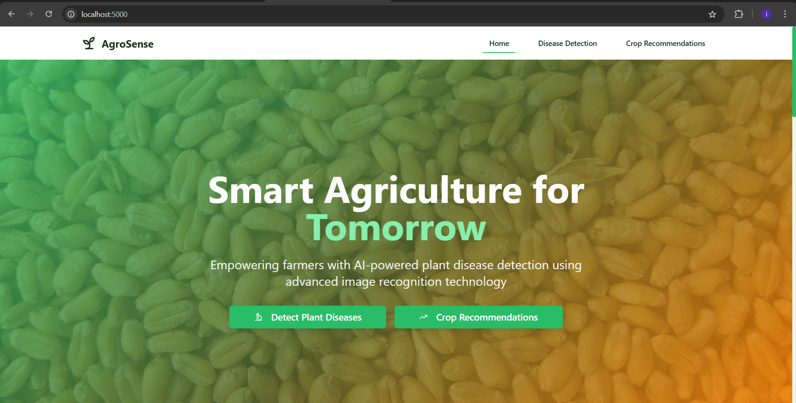
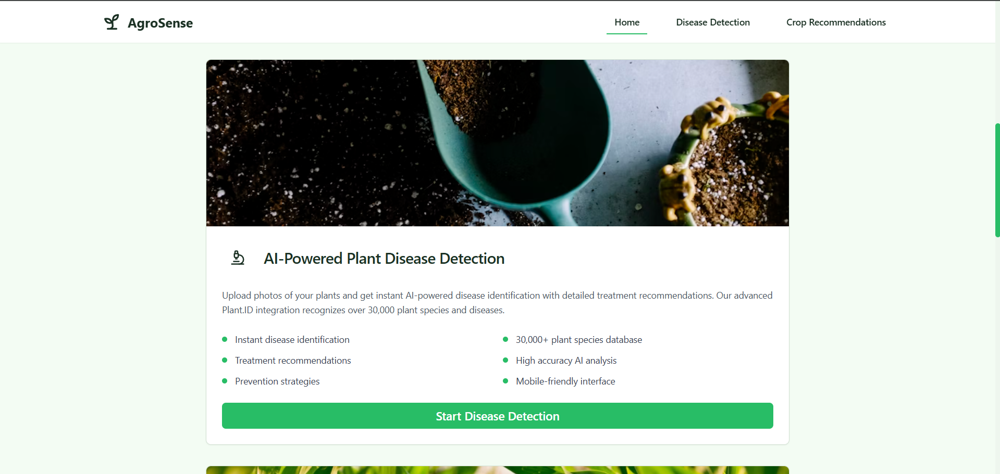
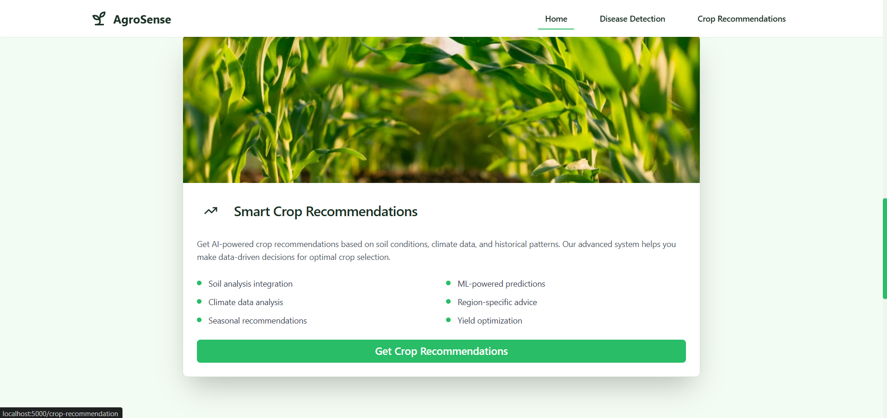
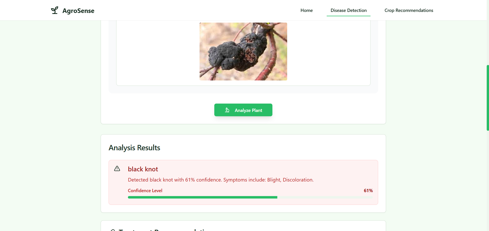
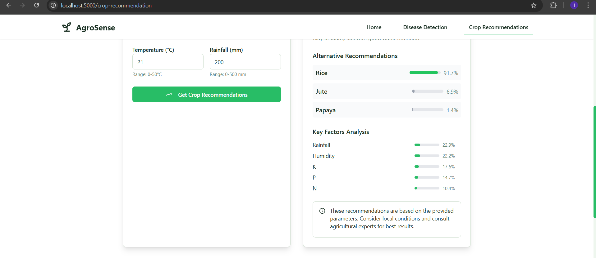

# AgroSense 🌱

An intelligent agricultural platform that combines AI-powered plant disease detection and smart crop recommendations to help farmers make data-driven decisions.

## Screenshots 📸

### Home Page



Modern landing page with easy access to both main features.

### Disease Detection


Upload plant images to get instant disease identification and treatment recommendations.

Detailed disease analysis with confidence scores and treatment suggestions.

### Crop Recommendations


Input form for soil and climate parameters.

AI-powered crop suggestions with confidence scores and alternative recommendations.

## Features 🚀

### 1. Plant Disease Detection
- Upload plant images for instant disease identification
- Powered by Plant.ID API with support for 30,000+ plant species
- Get detailed disease information and treatment recommendations
- Prevention strategies for better plant health

### 2. Crop Recommendations
- AI-powered crop suggestions based on soil and climate data
- Analysis of key parameters:
  - Soil nutrients (N, P, K)
  - Temperature
  - Rainfall
  - pH levels
  - Humidity
- Confidence scores for recommendations
- Alternative crop suggestions
- Feature importance analysis
- Trained on Crop Recommendation Dataset containing:
  - 2200+ instances of crop data
  - 22 different crop varieties
  - Soil composition data
  - Climate parameters

## Development Journey & Learnings 📚

During the development of AgroSense, several key learnings and challenges were encountered:

### Technical Skills Acquired
- Integrated AI services (Plant.ID API) with React frontend
- Implemented machine learning models using Python for crop recommendations
- Built a full-stack application using TypeScript and modern web technologies
- Learned to handle real-time data processing and API interactions
- Gained experience with modern UI libraries (Shadcn/ui, Tailwind CSS)

### Challenges Overcome
1. **Data Processing**
   - Handled complex soil and climate data for accurate crop recommendations
   - Implemented efficient image processing for plant disease detection
   - Managed data flow between Python ML models and Node.js server

2. **User Experience**
   - Designed an intuitive interface for inputting technical agricultural data
   - Created responsive layouts that work on both desktop and mobile devices
   - Implemented real-time feedback for user interactions

3. **System Integration**
   - Successfully integrated multiple technologies:
     - Frontend: React, TypeScript, Tailwind CSS
     - Backend: Node.js, Python
     - ML: Scikit-learn for crop recommendations
     - External APIs: Plant.ID for disease detection

### Key Achievements
- Developed a production-ready agricultural assistance tool
- Successfully implemented two complex features:
  - AI-powered plant disease detection
  - ML-based crop recommendation system
- Created a user-friendly interface for technical agricultural data
- Achieved high accuracy in crop recommendations using ML models

## Tech Stack 💻

### Frontend
- React with TypeScript
- Tailwind CSS for styling
- Shadcn/ui components
- Vite as build tool

### Backend
- Node.js server
- Python for ML models
- Plant.ID API integration
- Machine Learning models for crop recommendations

## Getting Started 🏁

### Prerequisites
- Node.js (v14 or higher)
- Python 3.8+
- npm or yarn package manager

### Installation

1. Clone the repository
```bash
git clone https://github.com/jkj-byte/agrosense.git
cd agrosense
```

2. Install frontend dependencies
```bash
npm install
```

3. Install Python dependencies
```bash
cd server
pip install -r requirements.txt
cd ..
```

### Running the Application

1. Start the development server
```bash
npx tsx server/index.ts
```

The application will be available at `http://localhost:5000`

## Project Structure 📁

```
agrosense/
├── client/               # Frontend React application
│   ├── src/
│   │   ├── components/  # Reusable UI components
│   │   ├── pages/       # Page components
│   │   └── ...
├── server/              # Backend Node.js server
│   ├── routes/         # API routes
│   ├── ml_model.py     # Machine learning model
│   ├── data/          # Dataset files
│   │   └── Crop_recommendation.csv  # Crop recommendation dataset
│   └── ...
├── shared/             # Shared types and utilities
└── uploads/           # Temporary storage for uploaded images
```

## Dataset 📊

The crop recommendation system uses the "Crop Recommendation Dataset" which includes:
- 2200+ entries with soil and climate data
- Parameters for each entry:
  - N (Nitrogen): ratio of Nitrogen content in soil
  - P (Phosphorous): ratio of Phosphorous content in soil
  - K (Potassium): ratio of Potassium content in soil
  - Temperature: temperature in degrees Celsius
  - Humidity: relative humidity in %
  - pH: pH value of the soil
  - Rainfall: rainfall in mm
- 22 different crop labels including rice, maize, chickpea, kidneybeans, pigeonpeas, mothbeans, mungbean, blackgram, lentil, pomegranate, banana, mango, grapes, watermelon, muskmelon, apple, orange, papaya, coconut, cotton, jute, coffee

## Note ⚠️
This project includes API keys in the code for demonstration purposes. In a production environment, these should be moved to environment variables.

## License 📝

This project is licensed under the MIT License - see the [LICENSE](LICENSE) file for details.

## Acknowledgments 🙏

- Plant.ID API for plant disease detection
- Shadcn/ui for beautiful components
- Crop Recommendation Dataset from Kaggle
